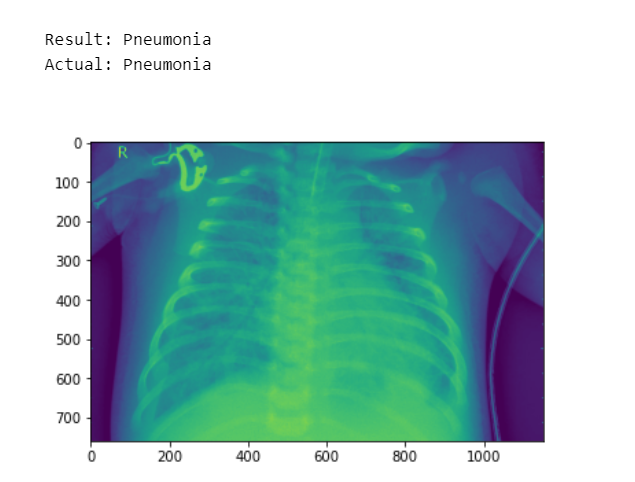
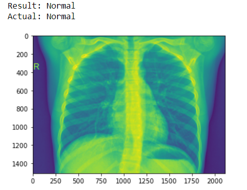

# Diagnosing_Pneumonia_PyTorch
Using PyTorch and CNNs to classify x-ray images that show traits of Pneumonia.

## Overview
In this project of mine, I employ the methods of Convolutional Neural Networks to classfiy x-ray images into the two following categories :-
* Pneumonia 
* Normal

I've implemented this using PyTorch. You can learn more about the code and process involved in achieving this from my [article](https://medium.com/@gsnWrites/diagnosing-pneumonia-with-deep-learning-709e6d3b38c2) on Medium.

## Dataset
The dataset we'll be using is called "Chest X-Ray Images (Pneumonia)" by Paul Mooney and can be found on Kaggle using this [link](https://www.kaggle.com/paultimothymooney/chest-xray-pneumonia). The dataset is organized into 3 folders (train, test, val) and contains sub-folders for each image category (Pneumonia/Normal). There are 5,863 X-Ray images (JPEG) in total. It's around 1-GB, but you can use the notebook environment built into Kaggle if you do not want to download the file.

## Outputs

 

The model uses the VGG-16 pre-trained model and achieves a validation accuracy of 93.5 % and a test accuracy of 82%.
You can further train the model or use different pre-trained models to compare their results.

## Notes
Do note that the results  obtained from this model is not sufficient enought to implement it real-time. 

I welcome you to fork/clone this repository and put your spin on it and further improve it to achieve better results according to your needs.

Happy Learning People ! Keep chasing your dreams ! ⭐️
